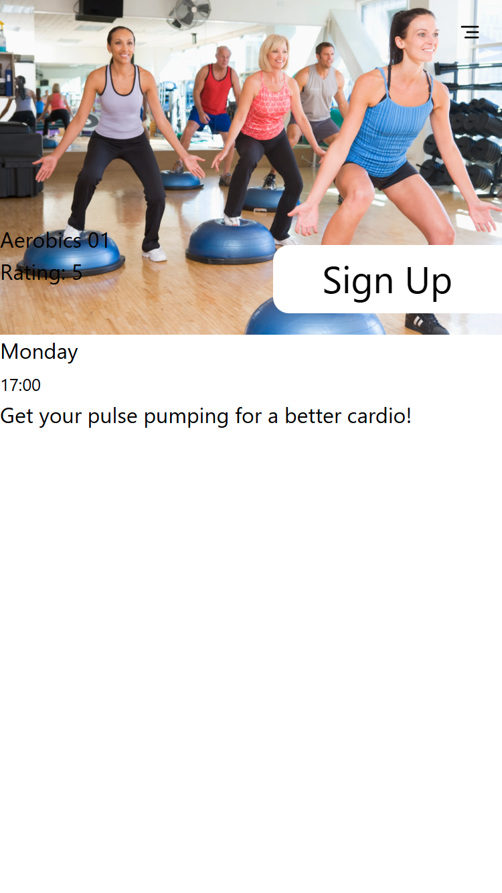

# Fitness Verden

Brian Emilius  
WU11

Se min app her: [https://brians-app.vercel.app](https://brians-app.vercel.app)



## Brugere og adgangskoder
| Brugernavn | Adgangskode |
| - | - |
| user1 | 1234 |
| user2 | 1234 |
| user3 | 1234 |
| user4 | 1234 |

[Link til Kanban](https://trello.com/whatevs)

## Dokumentation

Jeg har kodet min app i NextJS, som er et React framework.

# Tech-stack

* NextJS  
NextJS er et React framework. Det betyder at vi har alle React-funktionaliterne, men at vi også får adgang til serverside-rendering (SSR), samt fil- og mappe-baseret routing.  
NextJS er dokumenteret her: [https://nextjs.org](https://nextjs.org)
* Zod  
Zod er et bilbiotek som hjælper med blandt andet at validere strings, numbers, objekter og arrays. Jeg har brugt Zod i forbindelse med formularvalidering.  
Zod er dokumenteret her: [https://zod.dev/](https://zod.dev/)
* Swiper
* TailwindCSS
* React-icons
* React-spinners
* React-cookie

## Kode-eksempel
Jeg har valgt en funktion fra min kode fordi jeg synes den var interessant, men også svær at få til at virke.

Container til hele søgefunktionen
```javascript
"use client"
import SearchInput from "@/components/search-input"
import SearchResults from "@/components/search-results"
import { createContext, useState } from "react"

export const SearchContext = createContext("")

export default function SearchFunction({classes}) {
	const [searchText, setSearchText] = useState("")
	return (
		<SearchContext.Provider value={{searchText, setSearchText}}>
			<SearchInput />
			<SearchResults classes={classes} />
		</SearchContext.Provider>
	)
}
```

blah blah, forklaring af ovenstående (i ovenstående er det jo context, som er interessant).

## Perspektivering

Jeg har valgt at bruge frameworket NextJS, men jeg ved at der er andre frameworks, som også vlle kunne lade mig lave appen, fx. NuxtJS eller Vue.  
Jeg kender ikke disse to andre muligheder, derfor valgte jeg at bruge NextJS.  
NextJS har en lang række komponenter og hjælpe-funktionaliteter, som fx `<Image/>` og `<Link/>`. Derudover er der en række funktionaliteter som fx. error-pages, route grouping, layout-pages, osv...  
NextJS er desuden veldokumentet og udbredt som framework. Der er en stor community omkring frameworket, hvilket betyder at det også er let at finde hjælp, fx via StackOverflow.

Et eksempel på hvordan appen kan skaleres i fremtiden. Fx har jeg valgt at lave mobile-first, så det senere er lettere at lave tablet og desktop versioner.
Et andet eksempel: valget af hosting platform. Vercel og Netlify giver begge rigtig gode muligheder for at skalerebåde i forhold til pladsforbrug, server-tid, og data.

Slå ned på de steder i appen, hvor der er gjort klar til lazy-loading.